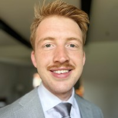

**1. Name**
My name is **Liam Whitenack**.

**2. Picture**

**3. Expectations for DASC 605**
I’m hoping DASC 605 helps me strengthen my understanding of statistics and how it applies to real data science work. I’m especially interested in connecting theory to practical use and getting better at thinking critically about models and results.

**4. Statistics Experience**
I’ve taken prior statistics courses covering topics like probability and regression, and I’ve applied statistical ideas in projects and professional data analysis work.

**5. Experience with R and Python**
I have much more experience with **Python**, which I’ve used extensively for data analysis and scripting. I’ve also used **R**, mostly in academic settings. While I understand why people like R, I personally find its syntax pretty ugly and much less intuitive than Python — even though I believe arrays should be 1-indexed.

**6. Favorite Machine Learning Method**
One of my favorite methods so far is **random forests** because they work well on a wide range of problems, handle nonlinear relationships, and don’t require a lot of tuning.

**7. How I Learn Best**
I learn best by **doing** — experimenting, coding, and working through problems hands-on.

**8. Interests Outside Data Science**
Outside of data science, I enjoy working on side projects, learning new tools, and generally building things. Here's the link to my website, a NYT-style game where you can decode a new message every day!
https://quotiac.io
